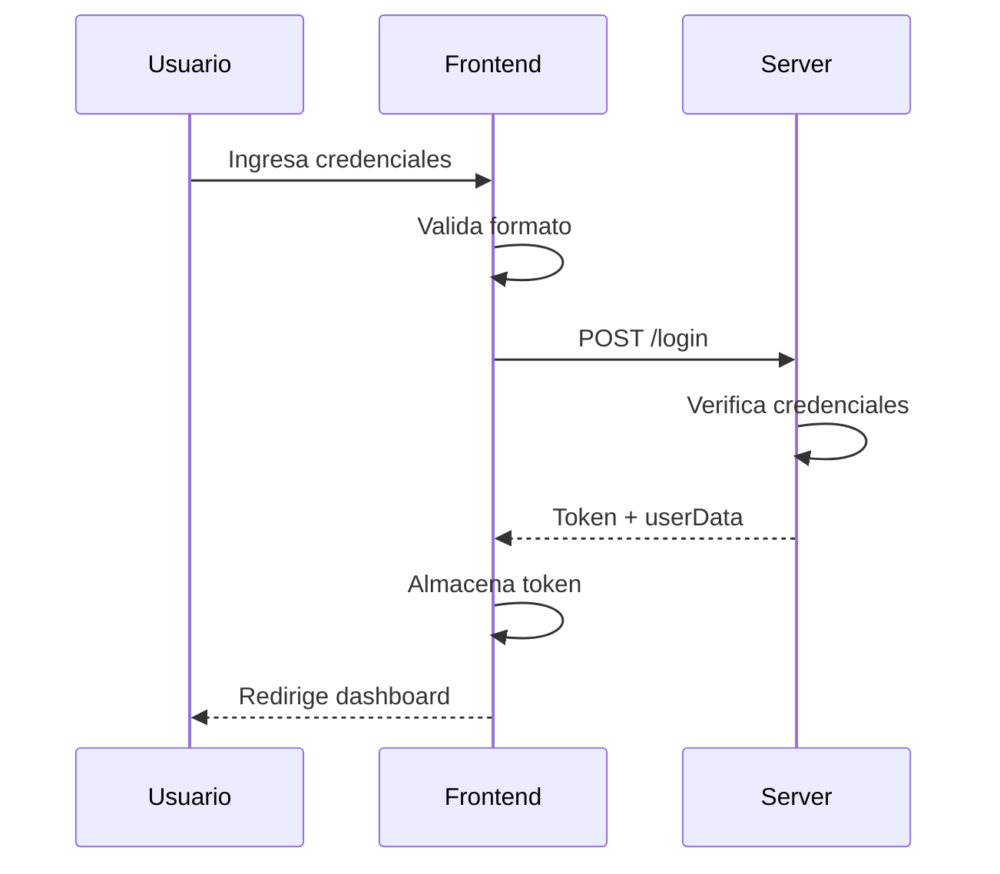

# Flujo de Autenticación

## Proceso de Login
1. Usuario ingresa credenciales
2. Validación frontend
3. Petición al servidor
4. Gestión de respuesta
5. Almacenamiento de token
6. Redirección

## Diagrama de Secuencia
